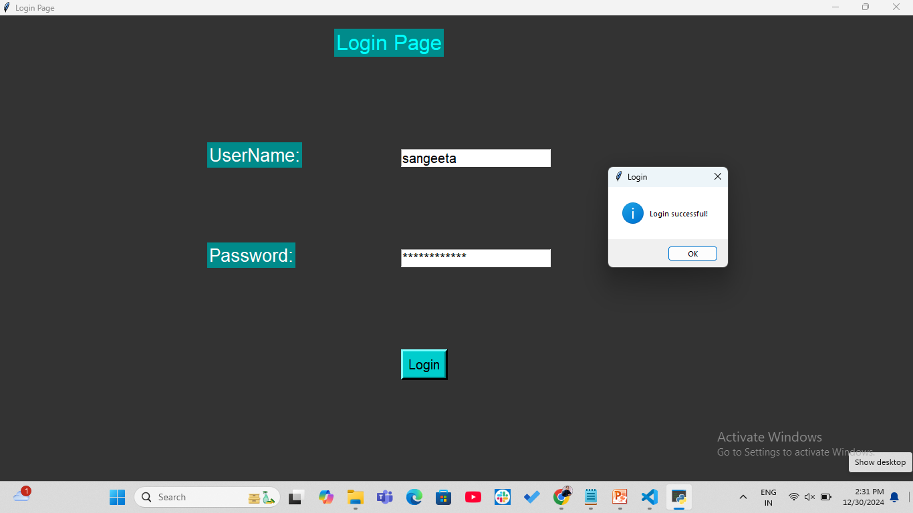

# Login Page with Audio Feedback

- This project is a simple Login Page application built using Tkinter (for the graphical user interface) and gTTS (Google Text-to-Speech) to provide audio feedback on successful login. It also validates user inputs for login credentials to ensure the username and password meet specific criteria.

## Features

- Login Page: A graphical user interface that asks for a username and password.
- Input Validation:
  The username should only contain alphabetic characters.
  The password must contain at least 8 characters, including letters, digits, and symbols.
- Audio Feedback: Upon successful login, a welcome message is played using the gTTS library.
- Clear Input Fields: After a successful login, the input fields are cleared for a new login attempt.

## Requirements

- Python 3.x
- Tkinter (usually comes pre-installed with Python)
- gTTS (pip install gTTS)
- playsound (pip install playsound)

## How to Run

1. Clone the repository:
   `git clone https://github.com/SangeetaSharma73/Login-page.git`

2. Install the required dependencies:
   `pip install gTTS playsound`

## Run the application:

`python login_page.py`

## Code Explanation

### Main Components

- Tkinter: Used for creating the graphical user interface (GUI).
  A Label is used to display the title and input prompts.

2. Entry fields are provided for entering the username and password.
3. A Button is used to trigger the login validation.

- gTTS: Converts the "Welcome" message into an audio file (welcome.mp3), which is played using the playsound library.

- Input Validation: The application checks:

1. If the username contains only alphabetic characters.
2. If the password is at least 8 characters long and contains a mix of letters, digits, and symbols.

### Functions

**`create_welcome_audio()`** :
Generates a welcome message and saves it as an audio file.

**`validate_login()`**: Validates the user's input and displays appropriate messages using the messagebox.

**`clear_entry_fields()`**: Clears the input fields after a successful login.

**`create_login_page()`**: Sets up the GUI components and starts the Tkinter event loop.

## Screenshots

